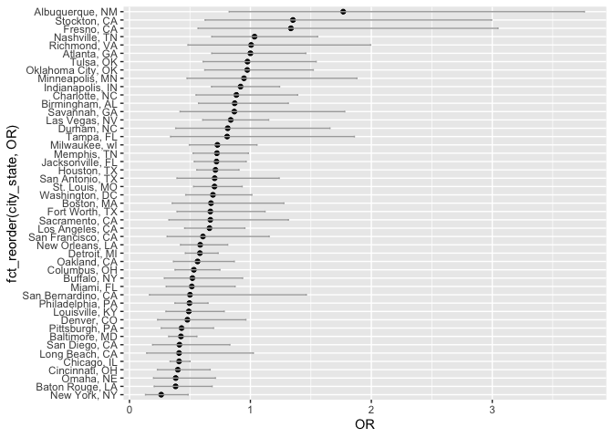
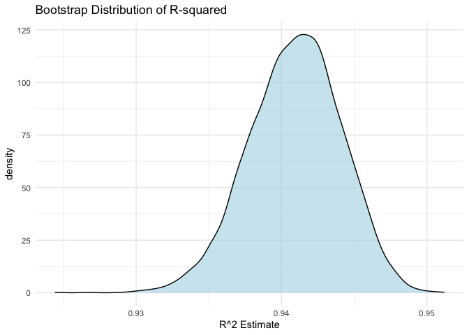
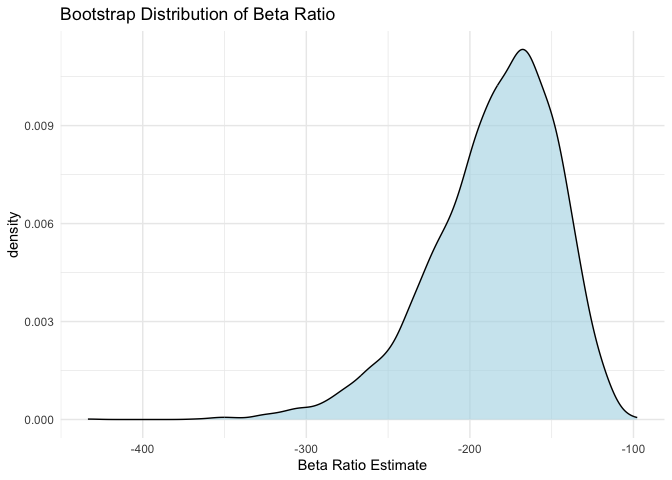
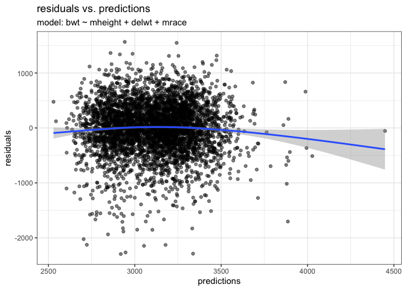
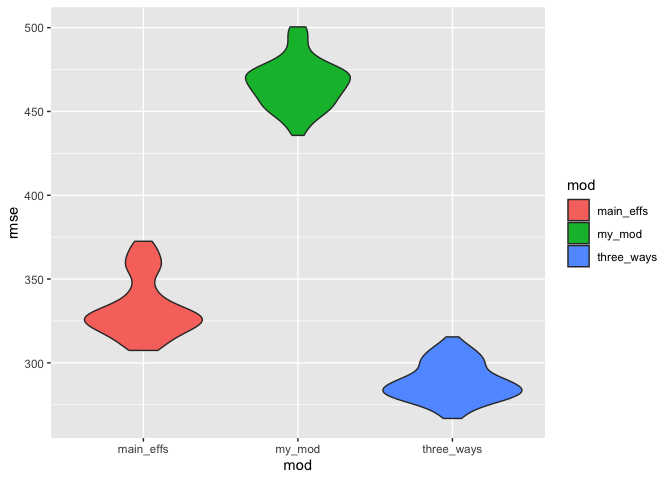

p8105_hw6_hc3654
================

``` r
library(tidyverse)
```

    ## ── Attaching core tidyverse packages ──────────────────────── tidyverse 2.0.0 ──
    ## ✔ dplyr     1.1.4     ✔ readr     2.1.5
    ## ✔ forcats   1.0.0     ✔ stringr   1.5.1
    ## ✔ ggplot2   3.5.2     ✔ tibble    3.3.0
    ## ✔ lubridate 1.9.4     ✔ tidyr     1.3.1
    ## ✔ purrr     1.1.0     
    ## ── Conflicts ────────────────────────────────────────── tidyverse_conflicts() ──
    ## ✖ dplyr::filter() masks stats::filter()
    ## ✖ dplyr::lag()    masks stats::lag()
    ## ℹ Use the conflicted package (<http://conflicted.r-lib.org/>) to force all conflicts to become errors

``` r
library(modelr)
library(mgcv)
```

    ## Loading required package: nlme
    ## 
    ## Attaching package: 'nlme'
    ## 
    ## The following object is masked from 'package:dplyr':
    ## 
    ##     collapse
    ## 
    ## This is mgcv 1.9-3. For overview type 'help("mgcv-package")'.

# Problem 1:

``` r
cities_df <- read_csv("https://raw.githubusercontent.com/washingtonpost/data-homicides/refs/heads/master/homicide-data.csv")
```

    ## Rows: 52179 Columns: 12
    ## ── Column specification ────────────────────────────────────────────────────────
    ## Delimiter: ","
    ## chr (9): uid, victim_last, victim_first, victim_race, victim_age, victim_sex...
    ## dbl (3): reported_date, lat, lon
    ## 
    ## ℹ Use `spec()` to retrieve the full column specification for this data.
    ## ℹ Specify the column types or set `show_col_types = FALSE` to quiet this message.

## Clean data

``` r
cities_clean_df <- cities_df |> 
  mutate(city_state = paste(city,state,sep = ", "), 
         solve = case_when(
          disposition == "Closed without arrest" ~ 0, 
          disposition == "Open/No arrest" ~ 0,
          disposition == "Closed by arrest" ~ 1)) |> 
  filter(!city_state %in% c("Dallas, TX", "Phoenix, AZ", "Kansas City, MO", "Tulsa, AL")) |> 
  filter(victim_race %in% c("White", "Black")) |> 
  mutate(victim_age = as.numeric(victim_age
  )) 
```

    ## Warning: There was 1 warning in `mutate()`.
    ## ℹ In argument: `victim_age = as.numeric(victim_age)`.
    ## Caused by warning:
    ## ! NAs introduced by coercion

## Regression

``` r
fit_log = cities_clean_df |> 
  filter(city_state == "Baltimore, MD") |> 
  glm(solve ~ victim_race + victim_sex + victim_age, data = _, family = binomial()) |> 
  broom::tidy(conf.int = TRUE)

fit_log
```

    ## # A tibble: 4 × 7
    ##   term             estimate std.error statistic  p.value conf.low conf.high
    ##   <chr>               <dbl>     <dbl>     <dbl>    <dbl>    <dbl>     <dbl>
    ## 1 (Intercept)       0.310     0.171        1.81 7.04e- 2  -0.0245  0.648   
    ## 2 victim_raceWhite  0.842     0.175        4.82 1.45e- 6   0.501   1.19    
    ## 3 victim_sexMale   -0.854     0.138       -6.18 6.26e-10  -1.13   -0.584   
    ## 4 victim_age       -0.00673   0.00332     -2.02 4.30e- 2  -0.0133 -0.000246

``` r
fit_log |> 
   filter(term == "victim_sexMale") |> 
  mutate(OR = exp(estimate), OR_lower = exp(conf.low), OR_higher = exp(conf.high)) |>
  select(term, OR, OR_lower, OR_higher) |> 
  knitr::kable(digits = 3)
```

| term           |    OR | OR_lower | OR_higher |
|:---------------|------:|---------:|----------:|
| victim_sexMale | 0.426 |    0.324 |     0.558 |

## For all cities

``` r
odds_ratios_cities <- cities_clean_df |>
  group_by(city_state) |>
  nest() |> 
  mutate(
    model_results = purrr::map(
      .x = data,
      .f = ~ glm(solve ~ victim_race + victim_sex + victim_age, 
                 data = .x, 
                 family = binomial()) |>
             broom::tidy(conf.int = TRUE))) |> 
      unnest(model_results) |> 
filter(term == "victim_sexMale") |> 
  mutate(OR = exp(estimate), OR_lower = exp(conf.low), OR_higher = exp(conf.high)) |>
  select(term, OR, OR_lower, OR_higher) |> 
  arrange(OR)
```

    ## Warning: There were 43 warnings in `mutate()`.
    ## The first warning was:
    ## ℹ In argument: `model_results = purrr::map(...)`.
    ## ℹ In group 1: `city_state = "Albuquerque, NM"`.
    ## Caused by warning:
    ## ! glm.fit: fitted probabilities numerically 0 or 1 occurred
    ## ℹ Run `dplyr::last_dplyr_warnings()` to see the 42 remaining warnings.

    ## Adding missing grouping variables: `city_state`

``` r
odds_ratios_cities |> 
  select(-term)
```

    ## # A tibble: 47 × 4
    ## # Groups:   city_state [47]
    ##    city_state         OR OR_lower OR_higher
    ##    <chr>           <dbl>    <dbl>     <dbl>
    ##  1 New York, NY    0.262    0.133     0.485
    ##  2 Baton Rouge, LA 0.381    0.204     0.684
    ##  3 Omaha, NE       0.382    0.199     0.711
    ##  4 Cincinnati, OH  0.400    0.231     0.667
    ##  5 Chicago, IL     0.410    0.336     0.501
    ##  6 Long Beach, CA  0.410    0.143     1.02 
    ##  7 San Diego, CA   0.413    0.191     0.830
    ##  8 Baltimore, MD   0.426    0.324     0.558
    ##  9 Pittsburgh, PA  0.431    0.263     0.696
    ## 10 Denver, CO      0.479    0.233     0.962
    ## # ℹ 37 more rows

``` r
odds_ratios_cities|> 
ggplot(aes(x = OR, y = fct_reorder(city_state, OR)))+
  geom_point()+
  geom_errorbarh(aes(xmin = OR_lower, xmax = OR_higher), 
                 height = 0.2, 
                 color = "darkgray")
```

<!-- -->

### Comment:

The plot reveals that the adjusted Odds Ratio (OR) is less than 1 for
the majority of cities, indicating a prevailing pattern where female
victims’ homicides have a higher solved advantage (odds) than those of
male victims.

However, a crucial finding is that the confidence interval for the OR
includes 1 for most cities. This means we lack sufficient statistical
evidence to claim a significant gender difference in clearance rates in
the majority of locations.

The results highlight two extremes: New York, NY, exhibits the strongest
disparity (OR lowest), where the difference in solved odds between male
and female victims is most pronounced and statistically significant.
Conversely, Albuquerque, NM, holds the highest OR, suggesting male
victims’ cases are either equally or more likely to be solved there,
it’s not significant due to including the 1.0.

The clustering of most OR estimates between 0.5 and 1.0 confirms that
while a bias exists, the magnitude of the disadvantage for male victims
is generally moderate to significant across the cities, driving the
overall conclusion that female victims’ homicides are generally more
likely to be solved across the dataset.

# Problem 2:

``` r
library(p8105.datasets)
data("weather_df")
```

``` r
weather_cleaned_df = weather_df |> 
  na.omit()

fit_t <- lm(tmax ~ tmin + prcp, data = weather_cleaned_df) 

fit_t |> 
  broom::tidy() |> 
  filter(term == "tmin"| term == "prcp") |> 
  select(term, estimate) |> 
  pivot_wider(
    names_from = term,
    values_from = estimate
  ) |> 
  mutate(ratio = tmin/prcp) |> 
  select(ratio)
```

    ## # A tibble: 1 × 1
    ##   ratio
    ##   <dbl>
    ## 1 -182.

``` r
fit_t |> 
  broom::glance() |> 
  select(r.squared)
```

    ## # A tibble: 1 × 1
    ##   r.squared
    ##       <dbl>
    ## 1     0.941

``` r
set.seed(1)

fit_bootstrap = 
  weather_cleaned_df |> 
  bootstrap(n = 5000) |> 
  mutate(
    df = map(strap, as_tibble),
    fits = map(df, \(df) lm(tmax ~ tmin + prcp, data = df))
  ) |> 
  mutate(r_squared = map_dbl(fits, 
                        .f = ~ broom::glance(.x) |> pull(r.squared)
    )) |>
  mutate(
      beta_ratio = map_dbl(fits, 
                         .f = ~ broom::tidy(.x) |> 
                           filter(term %in% c("tmin", "prcp")) |> 
                           select(term, estimate) |> 
                           pivot_wider(names_from = term, values_from = estimate) |> 
                           mutate(ratio = tmin / prcp) |>
                           pull(ratio))) |> 
  select(.id, r_squared, beta_ratio)
```

### For R^2

``` r
ggplot(fit_bootstrap, aes(x = r_squared)) +
  geom_density(fill = "lightblue", alpha = 0.6) +
  labs(title = "Bootstrap Distribution of R-squared", x = "R^2 Estimate") +
  theme_minimal()
```

<!-- -->

``` r
fit_bootstrap |>
  summarize(
    R2_lower = quantile(r_squared, 0.025),
    R2_upper = quantile(r_squared, 0.975)
  ) |> 
    knitr::kable(digits = 3)
```

| R2_lower | R2_upper |
|---------:|---------:|
|    0.934 |    0.947 |

Comments: Here is the plot of distribution for R^2. We can see in most
of the Beta Ratio estimate is between 0.93 to 0.95, The highest density
is around -0.943. From the table I saw the lower bound for the 95% CI of
beta ratio is 0.934. Upper Bound is -0.947. Which confirmed the results
from our plot.

### For Beta(1) / Beta(2)

``` r
ggplot(fit_bootstrap, aes(x = beta_ratio)) +
  geom_density(fill = "lightblue", alpha = 0.6) +
  labs(title = "Bootstrap Distribution of Beta Ratio", x = "Beta Ratio Estimate") +
  theme_minimal()
```

<!-- -->

``` r
fit_bootstrap |>
  summarize(
    Ratio_lower = quantile(beta_ratio, 0.025, na.rm = TRUE),
    Ratio_upper = quantile(beta_ratio, 0.975, na.rm = TRUE)
  ) |> 
    knitr::kable(digits = 3)
```

| Ratio_lower | Ratio_upper |
|------------:|------------:|
|    -274.795 |    -125.484 |

Comments: Here is the plot of distribution for Beta(1)/Beta(2). We can
see in most of the Beta Ratio estimate is between -100 to -300, The
highest density is around -170. From the table I saw the lower bound for
the 95% CI of beta ratio is -274.795. Upper Bound is -125.484. Which
confirmed the results from our plot.

# Problem 3:

``` r
baby_df_cleaned = read.csv("birthweight.csv") |> 
  janitor::clean_names() |> 
  mutate(babysex = as.factor(babysex), frace = as.factor(frace), malform = as.factor(malform), mrace = as.factor(mrace), parity = as.factor(parity), smoken = as.factor(smoken)) |> 
  drop_na()


my_mod <- lm(bwt ~ mheight + delwt + mrace + menarche + momage, data = baby_df_cleaned) 


baby_df_cleaned|> 
  add_predictions(my_mod) |> 
  add_residuals(my_mod) |> 
  ggplot(aes(x = pred, y = resid))+
  geom_point(alpha = 0.5)+
  geom_smooth(type = "lm")+
  labs(title = "residuals vs. predictions",
       subtitle = "model: bwt ~ mheight + delwt + mrace ",
       x = "predictions",
       y = "residuals") +
  theme_bw()
```

    ## Warning in geom_smooth(type = "lm"): Ignoring unknown parameters: `type`

    ## `geom_smooth()` using method = 'gam' and formula = 'y ~ s(x, bs = "cs")'

<!-- -->

### Comments:

My proposed model (my_mod) is built on a hypothesized structure intended
to link easily accessible maternal and timing factors to the final birth
weight (bwt, in grams). This selection strategy focuses on core inputs
that are hypothesized to influence the environment for fetal growth.

bwt ~ mheight + delwt + mrace + menarche + momage

mheight (Mother’s Height): Included to represent maternal structural
frame size, which is a structural factor that may underlie fetal size
capacity.

delwt (Mother’s Delivery Weight): This is used as a measure of maternal
nutritional status and overall physical contribution to the pregnancy
outcome.

mrace (Mother’s Race): Included as a necessary demographic covariate to
account for known population-level variations that underly differences
in baseline birth weight.

menarche (Menarche Age) and momage (Mother’s Age): These factors are
selected to adjust for maternal biological maturity and timing, which
are hypothesized to affect the efficiency and quality of the
reproductive process.

The scatter plot of Residuals vs. Fitted Values shows a wide, symmetric
dispersion of points around the zero line, suggesting the model captures
the overall linear trend reasonably well. The homoscedasticity (constant
variance) assumption is largely met, as the spread of the residuals is
consistent across the fitted range.

While the smoothing curve indicates a minor, shallow deviation from
perfect linearity, this trend is not systematic or strong enough to
invalidate the model. The bulk of the predictions (up to 3500g) show
minimal average residual deviation. Therefore, this model provides a
reasonable first-order linear approximation using the selected maternal
factors.

``` r
# Other two models
main_effs_mod = lm(bwt ~ blength + gaweeks, data = baby_df_cleaned)

three_ways_mod = lm(bwt ~ bhead + blength+ babysex, data = baby_df_cleaned)
```

``` r
# Comparison 

cv_df = 
  modelr::crossv_mc(baby_df_cleaned, n = 100) |> 
  mutate(
    train = map(train, as_tibble),
    test = map(test, as_tibble)
  )

cv_df_fits <- cv_df |>
  mutate(
    my_mod_fit = map(train, \(df) lm(my_mod, data = df)),
    main_effs_mod_fit = map(train, \(df) lm(main_effs_mod, data = df)),
    three_ways_mod_fit = map(train, \(df) lm(three_ways_mod, data = df))
  ) |> 
  mutate(
    rmse_my_mod = map2_dbl(my_mod_fit, test, modelr::rmse),
    rmse_main_effs = map2_dbl(main_effs_mod_fit, test, modelr::rmse),
    rmse_three_ways = map2_dbl(three_ways_mod_fit, test, modelr::rmse)
  )


cv_df_fits |>
  select(starts_with("rmse_")) |>
  pivot_longer(everything(), names_to = "model", values_to = "rmse") |>
  group_by(model) |>
  summarize(
    mean_rmse = mean(rmse),
    .groups = "drop"
  ) |> 
  knitr::kable(digits = 3)
```

| model           | mean_rmse |
|:----------------|----------:|
| rmse_main_effs  |   332.889 |
| rmse_my_mod     |   466.596 |
| rmse_three_ways |   288.584 |

``` r
cv_df_fits |> 
  select(rmse_main_effs, rmse_three_ways, rmse_my_mod) |> 
  pivot_longer(
    everything(),
    names_to = "mod",
    values_to = "rmse",
    names_prefix = "rmse_"
  ) |> 
  ggplot(aes(x = mod, y = rmse, fill = mod))+
  geom_violin()
```

<!-- -->

### Comments:

The results strongly indicate that Model 3 (rmse_three_ways) is the
optimal predictive model for birth weight among the three tested
structures.

Best Performance (rmse_three_ways): The lowest mean RMSE (288.584) is
clearly demonstrated by the blue violin plot. Its shape is centered at
the lowest point on the RMSE axis, confirming the best predictive
performance on unseen data. The relative narrowness of this violin
suggests the error is also highly stable across the 100 test splits.

Worst Performance (rmse_my_mod): The highest mean RMSE (466.596) is
shown by the green violin plot. Its position is the highest on the axis,
showing that the maternal-focused model consistently produced the
largest errors.

Intermediate Performance (rmse_main_effs): The red violin is centered
between the two extremes, confirming its moderate predictive capability.
